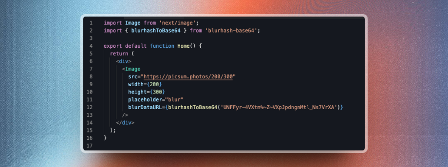
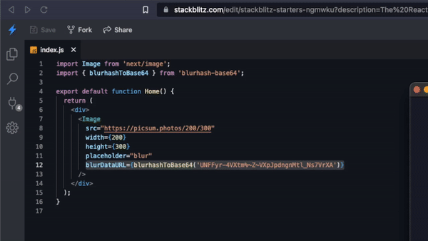

# Blurhash to Base64

:unicorn: Turn blurhash to dataURL on the go.




### :package: Requirements

- Node.js 16X LTS or Higher 📦

### :sparkles: Installation

- Install the NPM Package with the below command:

```bash
#npm
npm install blurhash-base64

#yarn
yarn add blurhash-base64

#pnpm
pnpm add blurhash-base64
```

### :bulb: Usage Example for next/image component

- Import `blurhashToBase64` in your project
- Set the `placeholder` prop to `blur`
- And pass the blurhash to `blurDataURL` prop surrounded by `blurhashToBase64` (See below example)

```javascript
import Image from "next/image";
import { blurhashToBase64 } from "blurhash-base64"; // Import blurhashToBase64

export default function Home() {
  return (
    <div>
      <Image
        src="https://picsum.photos/200/300"
        width={200}
        height={300}
        placeholder="blur"
        blurDataURL={blurhashToBase64("UNFFyr-4VXtm%~Z~VXpJpdngnMtl_Ns7VrXA")}
      />
    </div>
  );
}
```

### :ballot_box_with_check: Demo



### :six_pointed_star: Credits

- Blurhash is Generated with [blurhash-from-url](https://www.github.com/mcnaveen/blurhash-from-url) - A library to generate the blurhash from the given URL.
- [Blurhash CLI](https://github.com/mcnaveen/blurhash-cli) - Generate Blurhash in CLI

#### :green_heart: Message

I hope you find this useful. If you have any questions, please create an issue.
